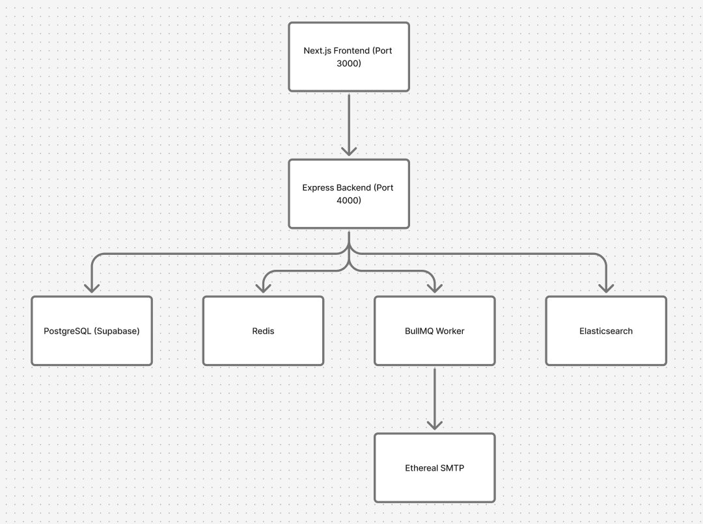

# ReachInbox Email Scheduler

A production-grade email scheduler service and dashboard built for the ReachInbox hiring assignment. Schedules, sends, and manages email campaigns at scale with BullMQ, Redis, Elasticsearch, and a polished Next.js frontend.

## Features

- **Delayed Email Scheduling**: BullMQ delayed jobs (no cron) with configurable start times
- **Persistent Queue**: Survives server restarts without losing or duplicating jobs
- **Idempotent Processing**: Atomic database claiming prevents duplicate sends across workers
- **Rate Limiting**: Per-sender hourly limits via atomic Redis Lua scripts
- **Minimum Delay**: Redis-coordinated delay between sends across multiple workers
- **Rate Limit Rescheduling**: Excess emails automatically deferred to the next available window
- **Slack Notifications**: Real OAuth integration; notifies on rate limit events
- **Elasticsearch Search**: Full-text search across emails scoped per user
- **Multiple Senders**: Per-sender SMTP credentials, rate limits, and delay tracking
- **Google OAuth**: Real Google login with session management
- **Ethereal SMTP**: Real email delivery via Ethereal with preview URLs
- **Bull Board**: Live BullMQ dashboard at `/admin/queues`
- **CSV Upload**: PapaParse-based recipient file parsing with validation
- **Pagination**: Backend-driven pagination for all email lists
- **Graceful Shutdown**: Clean worker and connection teardown on SIGTERM/SIGINT

## Architecture



### Email Lifecycle


### How Scheduling Works

1. Frontend submits campaign with recipients, subject, body, start time, delay, and hourly limit
2. Backend validates input and sender ownership
3. Campaign + email records created in a PostgreSQL transaction
4. Scheduled times calculated respecting delay and hourly limits
5. BullMQ delayed jobs added with deterministic job IDs (`email-{emailId}`)
6. Emails indexed in Elasticsearch (non-blocking)
7. Worker picks up jobs at scheduled times

### How Persistence Works

- **BullMQ + Redis**: Jobs persist in Redis with `appendonly yes` (AOF)
- **PostgreSQL**: Email records are the source of truth
- **Startup Reconciliation**: On restart, the worker:
  1. Resets `PROCESSING` emails back to `SCHEDULED`
  2. Resets `RATE_LIMITED` emails back to `SCHEDULED`
  3. Checks for `SCHEDULED` emails missing BullMQ jobs
  4. Re-creates missing jobs with correct delays
  5. Uses deterministic job IDs to prevent duplicates

### How Rate Limiting Works

- **Atomic Redis Lua Scripts**: Rate limit checks and increments are atomic
- **Per-Sender Hourly Windows**: Key format `rate_limit:{senderId}:{YYYY-MM-DDTHH}`
- **Reservation Model**: Worker atomically reserves a slot before sending
- **Safe Under Concurrency**: 10+ workers cannot exceed limits due to race conditions
- **Rescheduling**: When limit is hit, emails are delayed to the next hour window
- **Slack Notification**: First rate-limit event per sender per hour triggers Slack message (deduplicated)

### How Minimum Delay Works

- Redis key tracks last send timestamp per sender: `send_delay:{senderId}`
- Lua script atomically checks elapsed time and updates timestamp
- Multiple workers coordinate through Redis, not process memory
- Default: 2 seconds between sends per sender

### Idempotency Design

- Deterministic idempotency keys: `SHA256(campaignId:recipient)`
- Atomic claiming: `UPDATE emails SET status='PROCESSING' WHERE status='SCHEDULED' AND id=?`
- `updateMany` returns affected count; 0 = already claimed
- BullMQ deterministic job IDs prevent duplicate queue entries
- **Known limitation**: If SMTP accepts a message and the process crashes before recording success, absolute exactly-once delivery cannot be guaranteed. The system minimizes this window.

## Tech Stack

| Layer      | Technology                               |
| ---------- | ---------------------------------------- |
| Frontend   | Next.js, React, TypeScript, Tailwind CSS |
| Backend    | Express.js, TypeScript, Prisma           |
| Database   | PostgreSQL (Supabase)                    |
| Queue      | BullMQ + Redis                           |
| Email      | Nodemailer + Ethereal SMTP               |
| Search     | Elasticsearch 8.x                        |
| Auth       | Google OAuth (Passport.js)               |
| Slack      | Real Slack OAuth + API                   |
| Queue UI   | Bull Board                               |
| Logging    | Pino                                     |
| Validation | Zod                                      |

## Prerequisites

- Node.js >= 18
- Docker & Docker Compose
- A Supabase account (free tier works)
- Google Cloud Console project (for OAuth)
- Slack app (for notifications)
- Ethereal email account

## Quick Start

### 1. Clone and Install

```bash
git clone <repo-url>
cd reachinbox-email-scheduler

# Install backend
cd apps/backend && npm install && cd ../..

# Install frontend
cd apps/frontend && npm install && cd ../..
```

### 2. Start Infrastructure

```bash
docker compose -f docker/docker-compose.yml up -d
```

This starts Redis (port 6379) and Elasticsearch (port 9200) with persistent volumes.

### 3. Configure Supabase PostgreSQL

1. Create a Supabase project at https://supabase.com
2. Go to Settings → Database → Connection string
3. Copy the connection string

### 4. Configure Google OAuth

1. Go to the [Google Cloud Console](https://console.cloud.google.com/).
2. Create a new project or select an existing one.
3. Navigate to **APIs & Services** → **OAuth consent screen** and configure it (User Type: External, fill required fields).
4. Go to **Credentials** → **Create Credentials** → **OAuth client ID**.
5. Select **Web application** as the application type.
6. Under **Authorized redirect URIs**, add exactly: `http://localhost:4000/auth/google/callback`
7. Click **Create** and copy the generated **Client ID** and **Client Secret**.

### 5. Configure Ethereal Email

1. Go to https://ethereal.email
2. Click "Create Account"
3. Copy the SMTP credentials

### 6. Configure Slack App (Optional)

1. Go to [Slack API: Applications](https://api.slack.com/apps) and click **Create New App** (from scratch).
2. Choose a name and your workspace.
3. In the left sidebar, click **OAuth & Permissions**.
4. Scroll down to **Redirect URLs**, click **Add New Redirect URL**, and enter: `http://localhost:4000/api/slack/callback` (Click **Save URLs**).
5. Scroll down to **Scopes** → **User Token Scopes** and add:
   - `chat:write`
   - `channels:read`
6. Go back to **Basic Information** (left sidebar).
7. Scroll down to **App Credentials** and copy the **Client ID** and **Client Secret**.

### 7. Environment Variables

```bash
# Backend
cp apps/backend/.env.example apps/backend/.env
# Edit apps/backend/.env with your credentials

# Frontend
cp apps/frontend/.env.example apps/frontend/.env.local
```

### 8. Database Migration

```bash
cd apps/backend
npx prisma db push
npx prisma generate
```

### 9. Run the Application

```bash
# Terminal 1: Backend API
cd apps/backend && npm run dev

# Terminal 2: BullMQ Worker
cd apps/backend && npm run dev:worker

# Terminal 3: Frontend
cd apps/frontend && npm run dev
```

### 10. Access

- Frontend: http://localhost:3000
- Backend API: http://localhost:4000
- Bull Board: http://localhost:4000/admin/queues
- Health Check: http://localhost:4000/health

## API Reference

| Method | Endpoint                                  | Description                         |
| ------ | ----------------------------------------- | ----------------------------------- |
| GET    | `/health`                               | Health check with dependency status |
| GET    | `/auth/google`                          | Initiate Google OAuth               |
| GET    | `/auth/google/callback`                 | Google OAuth callback               |
| GET    | `/auth/me`                              | Get current user                    |
| POST   | `/auth/logout`                          | Logout                              |
| POST   | `/api/emails/schedule`                  | Schedule email campaign             |
| GET    | `/api/emails/scheduled?page=1&limit=25` | Get scheduled emails                |
| GET    | `/api/emails/sent?page=1&limit=25`      | Get sent emails                     |
| GET    | `/api/emails/search?q=query`            | Search emails (Elasticsearch)       |
| GET    | `/api/senders`                          | Get user's senders                  |
| POST   | `/api/senders`                          | Create a sender                     |
| GET    | `/api/slack/connect`                    | Get Slack OAuth URL                 |
| GET    | `/api/slack/callback`                   | Slack OAuth callback                |
| GET    | `/api/slack/status`                     | Get Slack connection status         |
| POST   | `/api/slack/disconnect`                 | Disconnect Slack                    |

## Environment Variables

| Variable                           | Description                      | Default                                        |
| ---------------------------------- | -------------------------------- | ---------------------------------------------- |
| `NODE_ENV`                       | Environment                      | `development`                                |
| `PORT`                           | Backend port                     | `4000`                                       |
| `DATABASE_URL`                   | PostgreSQL connection string     | Required                                       |
| `DIRECT_URL`                     | Direct PostgreSQL URL (Supabase) | Required                                       |
| `REDIS_URL`                      | Redis connection URL             | `redis://localhost:6379`                     |
| `ELASTICSEARCH_URL`              | Elasticsearch URL                | `http://localhost:9200`                      |
| `GOOGLE_CLIENT_ID`               | Google OAuth client ID           | Required                                       |
| `GOOGLE_CLIENT_SECRET`           | Google OAuth client secret       | Required                                       |
| `GOOGLE_CALLBACK_URL`            | Google OAuth callback            | `http://localhost:4000/auth/google/callback` |
| `SESSION_SECRET`                 | Express session secret           | Required                                       |
| `ETHEREAL_HOST`                  | Ethereal SMTP host               | `smtp.ethereal.email`                        |
| `ETHEREAL_PORT`                  | Ethereal SMTP port               | `587`                                        |
| `ETHEREAL_USER`                  | Ethereal SMTP username           | Required                                       |
| `ETHEREAL_PASSWORD`              | Ethereal SMTP password           | Required                                       |
| `SLACK_CLIENT_ID`                | Slack OAuth client ID            | Optional                                       |
| `SLACK_CLIENT_SECRET`            | Slack OAuth client secret        | Optional                                       |
| `SLACK_REDIRECT_URI`             | Slack OAuth redirect URI         | `http://localhost:4000/api/slack/callback`   |
| `WORKER_CONCURRENCY`             | BullMQ worker concurrency        | `10`                                         |
| `MIN_EMAIL_DELAY_MS`             | Min delay between sends (ms)     | `2000`                                       |
| `MAX_EMAILS_PER_HOUR_PER_SENDER` | Hourly limit per sender          | `100`                                        |
| `FRONTEND_URL`                   | Frontend URL for CORS            | `http://localhost:3000`                      |

## Demo Scenario

Set environment variables for demo:

```
WORKER_CONCURRENCY=5
MIN_EMAIL_DELAY_MS=2000
MAX_EMAILS_PER_HOUR_PER_SENDER=5
```

1. **Login**: Google OAuth login → redirect to dashboard
2. **Add Sender**: Add an Ethereal sender
3. **Connect Slack**: OAuth flow → connected status
4. **Upload CSV**: Upload 10 recipients
5. **Schedule**: Set start time to now + 1 minute, hourly limit = 5
6. **Watch**: First 5 emails send, remaining 5 rescheduled to next hour
7. **Slack Notification**: Rate limit notification appears in Slack
8. **Sent Emails**: View Ethereal preview URLs
9. **Search**: Search by recipient or subject
10. **Restart Test**: Schedule future email → stop backend → restart → email still sends

## Load Testing

```bash
cd apps/backend
npx tsx src/scripts/load-test.ts 100 <senderId> <userId>
```

## Requirement Checklist

| Requirement                       | Status | Location                                         |
| --------------------------------- | ------ | ------------------------------------------------ |
| TypeScript backend                | ✅     | `apps/backend/`                                |
| Express.js                        | ✅     | `apps/backend/src/app.ts`                      |
| BullMQ + Redis queue              | ✅     | `apps/backend/src/queues/`                     |
| Delayed scheduling (no cron)      | ✅     | `apps/backend/src/queues/emailQueue.ts`        |
| PostgreSQL (Supabase)             | ✅     | `apps/backend/prisma/schema.prisma`            |
| Prisma ORM                        | ✅     | `apps/backend/src/db/prisma.ts`                |
| Ethereal SMTP                     | ✅     | `apps/backend/src/integrations/ethereal/`      |
| Persistence on restart            | ✅     | `apps/backend/src/services/reconciliation.ts`  |
| Idempotency                       | ✅     | Worker atomic claiming                           |
| Worker concurrency (configurable) | ✅     | `WORKER_CONCURRENCY` env var                   |
| Minimum delay (Redis-coordinated) | ✅     | `apps/backend/src/services/rateLimiter.ts`     |
| Hourly rate limit (Redis Lua)     | ✅     | `apps/backend/src/services/rateLimiter.ts`     |
| Rate limit rescheduling           | ✅     | `apps/backend/src/worker.ts`                   |
| Slack OAuth (real)                | ✅     | `apps/backend/src/integrations/slack/`         |
| Slack notifications (real)        | ✅     | `apps/backend/src/integrations/slack/`         |
| Elasticsearch indexing + search   | ✅     | `apps/backend/src/integrations/elasticsearch/` |
| Bull Board dashboard              | ✅     | `/admin/queues`                                |
| Google OAuth (real)               | ✅     | `apps/backend/src/integrations/google/`        |
| Next.js + React + TypeScript      | ✅     | `apps/frontend/`                               |
| Tailwind CSS                      | ✅     | `apps/frontend/app/globals.css`                |
| CSV/TXT upload + parsing          | ✅     | `ComposeModal.tsx` (PapaParse)                 |
| Scheduled emails table            | ✅     | `ScheduledEmailsTable.tsx`                     |
| Sent emails table                 | ✅     | `SentEmailsTable.tsx`                          |
| Multiple senders                  | ✅     | `Sender` model + per-sender limits             |
| Pagination                        | ✅     | Backend + frontend                               |
| Loading states                    | ✅     | Skeleton loading components                      |
| Empty states                      | ✅     | `EmptyState` component                         |
| Error handling                    | ✅     | Toast notifications + error states               |
| User isolation                    | ✅     | All queries scoped to userId                     |
| Graceful shutdown                 | ✅     | SIGTERM/SIGINT handlers                          |
| Health check                      | ✅     | `GET /health`                                  |
| Docker Compose                    | ✅     | `docker/docker-compose.yml`                    |
| Load test script                  | ✅     | `apps/backend/src/scripts/load-test.ts`        |

## Known Limitations

- **Exactly-once delivery**: If SMTP accepts but the process crashes before recording, a duplicate is theoretically possible. This is inherent to any system without provider-level idempotency.
- **Elasticsearch consistency**: Elasticsearch indexing is eventually consistent and non-blocking. If Elasticsearch is down, emails still schedule and send correctly.
- **Session storage**: Using default memory store for sessions in development. For production, use Redis-backed sessions.

## Security

- Secure HTTP-only cookies for sessions
- Helmet.js security headers
- CORS restricted to frontend origin
- Input validation via Zod schemas
- SQL injection prevention via Prisma
- Elasticsearch queries scoped to authenticated user
- SMTP passwords and Slack tokens never exposed to frontend
- Pino log redaction for sensitive fields

## License

MIT
